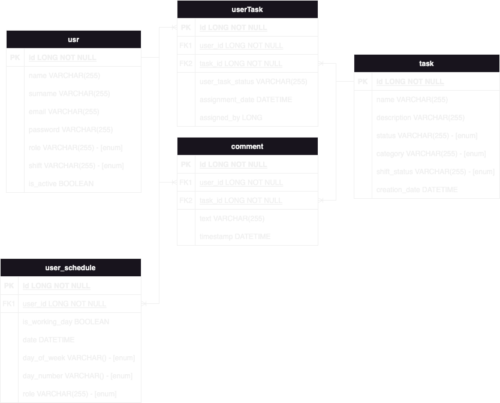

# Media-Workbench

## Motivation

The journey of Media-Workbench began from a simple need within our team for better workflow management. It was a suggestion I made, hoping to find a solution that could streamline our processes and bring some order to the chaos. Developed using Java and Spring Boot, wrapped up in Docker for easy deployment, and set into motion with GitLab CICD pipelines utilizing Infrastructure as Code (IaC) techniques, Media-Workbench is our humble attempt to address this need.

## Why Use `Media-Workbench`?

Media-Workbench is not just another tool; it's a reflection of our team's effort to make workflow management as intuitive and seamless as possible. Here's why you might find it useful:

- **Simple and straightforward**: Designed to be user-friendly, allowing you to get your work done without getting lost in complexity.
- **Built with care**: Every feature has been developed with the user's workflow in mind, aiming to enhance efficiency without overwhelming.
- **Community-driven**: We're always looking for feedback to make Media-Workbench better for everyone.


## Quick Start

```bash
# Clone the repository
git clone https://gitlab.com/mtimoxenko/media-workbench
cd media-workbench

# Ensure Docker and Docker Compose are installed on your system
# Start the application with Docker Compose
docker-compose up -d

# View logs
docker-compose logs -f

# Stop and remove containers
docker-compose down

# Access the frontend
Visit http://localhost:3000
```


## Components
The Media-Workbench project is organized into several main components, each with its own responsibilities:

- **back**: The backend service that manages the API and business logic.
  - [Read more about the backend](back/README.md)
- **front**: The frontend interface where users interact with the Media-Workbench.
  - [Read more about the frontend](front/README.md)
- **_cicd**: Continuous Integration and Continuous Deployment configurations and scripts.
  - [Read more about CI/CD](_cicd/README.md)


## Additional Features

### H2 Console for Testing
For development and testing purposes, the H2 console can be accessed at:
http://localhost:8080/h2-console/

This provides a convenient web interface for interacting with the H2 database used by the backend.

### OpenAPI Definitions
Explore the backend's API with the OpenAPI definitions available at:
http://localhost:8080/swagger-ui/index.html

This interface facilitates easy testing and interaction with the API endpoints.


## Testing Credentials

To log in to the application during development or testing, you can use the following credentials:

| Email             | Password | Role      | Shift   |
|-------------------|----------|-----------|---------|
| jmiga@noc.com     | noche    | REPORTER  | NIGHT   |
| bsilver@noc.com   | noche    | HELPER    | NIGHT   |
| lbardo@noc.com    | dia      | ATTENDANT | DAY     |
| mvillano@noc.com  | dia      | NULL      | DAY     |
| dturbio@noc.com   | tarde    | NULL      | EVENING |
| gburgues@noc.com  | tarde    | NULL      | EVENING |


## Entity-Relationship (ER) Model
Below is the ER model of the Media-Workbench project:



## Contributing
Contributions to Media-Workbench are welcome.

## License
This project is licensed under the MIT License - see the [LICENSE](LICENSE.md) file for details.

## Contact
For any queries or suggestions, please reach out to project maintainers at mtimochenko@tutanota.com.