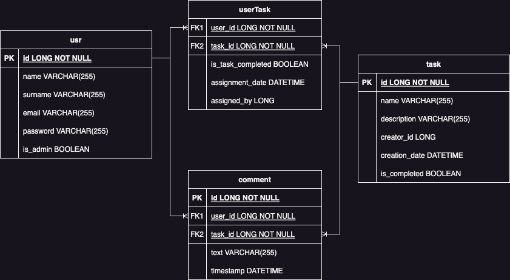

# NOC-ME-Workbench

## Overview
NOC-ME-Workbench is a comprehensive task management system designed for Network Operations Centers (NOCs), focusing on multimedia workflows and efficient operations management. This platform provides a robust solution for handling diverse tasks, monitoring operations, and managing multimedia content seamlessly.

## Features
- **Task Management**: Efficiently manage and track tasks specific to NOC operations.
- **Multimedia Integration**: Seamlessly integrate various multimedia elements into the workflow.
- **Real-time Monitoring**: Monitor operations in real-time for quick decision-making and responsiveness.
- **User-Friendly Interface**: Intuitive and user-friendly interface for easy navigation and usage.
- **Customizable Workflows**: Tailor the workflow to meet specific operational needs.
- **Reporting and Analytics**: Advanced tools for reporting and analyzing operational data.

## Getting Started
To get started with NOC-ME-Workbench, follow these steps:

1. **Setup**: Clone the repository and set up the project environment.
2. **Configuration**: Configure the application settings as per your NOC requirements.
3. **Run**: Start the application and begin task management.

## Installation
```bash
git clone https://github.com/your-repository/NOC-ME-Workbench.git
cd NOC-ME-Workbench
# Follow specific setup instructions
```

## Usage
After setting up, follow the user guide to start using NOC-ME-Workbench for managing NOC tasks and workflows.

## Contributing
Contributions to NOC-ME-Workbench are welcome.

## License
This project is licensed under the MIT License - see the `LICENSE.md` file for details.

## Contact
For any queries or suggestions, please reach out to project maintainers at mtimochenko@tutanota.com.

## Acknowledgments
- Special thanks to the team and contributors who have made this project possible.

## Entity-Relationship (ER) Model
Below is the ER model of the NOC-ME-Workbench project:
